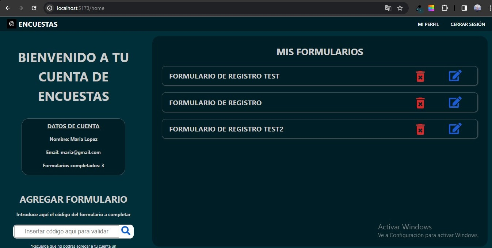

# **Crear encuestas interactivas** | Challenge Técnico 

## Application of interactive surveys

<p align="center">
 <a href="#demo">App Preview</a> •
 <a href="#requirements">Requirements</a> •
 <a href="#technologies">Technologies</a> •
 <a href="#features">Featured Features</a> •
 <a href="#guia">Use guide</a> •
 <!-- <a href="#instrucciones">Instructions</a> • -->
 <a href="#json">Package json</a> •
 <a href="#author">Author</a>
</p>

<h1 id="demo">App Preview</h1>

<h1 align="center">
  
</h1>

<h1 id="requirements">Requirements</h1>

Before starting, you need to install in your machines the following tools:
[Git](https://git-scm.com), [Node.js](https://nodejs.org/en/).
Besides that, is good to have a good code editor as [VSCode](https://code.visualstudio.com/)

## 🎲 Running the App

```bash
# Clone this repository
$ git clone <https://github.com/PedroFedeCasillas/client-encuestas>

# Access the project folder using terminal/cmd
$ cd client-encuestas

# Install the dependencies
$ npm install

# Execute the application on development mode
$ npm run dev

# The server will start on port:3000 - access <http://localhost:3000>
```

<h1 id="technologies">🛠 Technologies</h1>

The following tools were used on this project:

- [React](https://pt-br.reactjs.org/)
- [Vite](https://vitejs.dev/)
- [Redux](https://redux.js.org/)
- [CSS](https://developer.mozilla.org/es/docs/Web/CSS)

<h1 id="features">Funcionalidades Destacadas</h1>

La aplicación, **Crear encuestas interactivas**, ofrece una serie de características imprescindibles:

- **Gestión de Cuentas**: Los usuarios pueden crear cuentas e iniciar sesión de manera segura.
- **Completar Formularios**: Permite a los usuarios completar formularios generados a partir de los ítems de un archivo JSON.
- **Guardar y Editar Respuestas**: Las respuestas a los formularios se guardan y pueden ser editadas posteriormente.
- **Manejo de Errores**: Se ha implementado un sistema de manejo de errores para evitar datos erroneos.
- **Estilo Personalizado**: Se utilizo CSS puro para lograr un diseño simple y fácil de usar.

<!-- ### **Desarrollo y Deploy**

El proyecto ha sido desarrollado en un tiempo de 48 horas. Para el deploy, se utilizaron las plataformas de alojamiento Railway (base de datos y backend) y Render (frontend). -->

<h2 id="guia">⚠️ GUÍA DE USO</h2>

A continuación, una guía paso a paso para utilizar la aplicación **Crear encuestas interactivas**:

### **1. Crear Cuenta y Iniciar Sesión**

- Cuando accedas a la aplicación, encontrarás una landing page con la opción de iniciar sesión. Si es tu primera visita, selecciona "Crear Cuenta".
- Llena los campos requeridos y, una vez validados, haz clic en "Crear Cuenta".
- Ahora podrás iniciar sesión con la cuenta recién creada.

### **2. Explorar el Dashboard y los Formularios**

- Al acceder, serás recibido por un dashboard que muestra los formularios completados y tus datos.
- En la esquina inferior izquierda, encontrarás una barra de búsqueda que te permite acceder rápidamente a nuevos formularios. (Por el momento solo hay 3 formularios de prueba. Con el codigo "1", podras visualizar el formulario "Formulario de registro", con el codigo "2" el formulario "Formulario de Validación" y con el "3" el formulario "Test de Gustos Personales")
- Si ingresas un código de formulario inválido o uno que ya has completado, se te notificará el error.
- Los códigos válidos te llevarán a la página de completar el formulario.

### **3. Completar Formularios**

- Los formularios no se guardarán automáticamente mientras los completas. Debes enviarlos para que se registren.
- Una vez enviados, volverás al dashboard y verás que el formulario se ha añadido a tus respuestas.
- No se te permitira enviar formularios que contengan datos erroneos. 

### **4. Editar/Eliminar Formularios**

- En la lista de formularios completados, encontrarás botones para "ver respuestas" y eliminar.
- Antes de eliminar un formulario, se te pedirá confirmación para evitar eliminaciones accidentales.
- Al hacer click en "ver respuestas", se te redirigirá a una vista donde podrás ver y modificar tus respuestas.
- Tanto al editar como al completar por primera vez un formulario, podrás ver un botón en la barra de navegación para regresar al perfil.

### **5. Cerrar Sesión**

- Desde la barra de navegación, puedes cerrar sesión en cualquier momento.
- Ten en cuenta que la barra de navegación solo aparecerá cuando estés logueado.
- Sin inicio de sesión, no podrás acceder a la aplicación.

<!-- <h2 id="instrucciones">INSTRUCCIONES</h2> -->

<!-- Tu misión consiste en desarrollar una aplicación para crear encuestas interactivas
similares a Google Forms. A continuación, se detallan los requisitos clave del desafío:

### **Objetivo del Desafío:** 
Crear una aplicación utilizando la tecnología de tu
preferencia (ya sea en el ámbito frontend o backend) que pueda leer un archivo
JSON proporcionado y generar interfaces de encuestas únicas para cada ítem en
el archivo. Asegúrate de que el diseño y la estética de la aplicación sean distintos
a los de Google Forms.
**Estás autorizado a utilizar librerías según consideres necesario para lograrlo.

### **Requisitos del Proyecto:**
- Desarrollar una aplicación que lea el archivo JSON proporcionado y muestre
interfaces de encuestas personalizadas.
- Implementar enviar las respuestas de las encuestas a una base de datos de
tu elección. Asegúrate de que esta base de datos sea de tu propiedad y no
compartas el acceso a la misma.
- Diseñar una ruta adicional en la aplicación para mostrar las respuestas
almacenadas en la base de datos. Al presionar el botón "Enviar/Send" en el
formulario de encuesta, deberá aparecer un mensaje y proporcionar acceso
a una nueva ruta/vista con las respuestas. Además, el usuario podrá
actualizar su respuesta.

### **Puntos Importantes:**
- Enviar el link del repositorio/deploy por el mail.
- Si tienes alguna pregunta o duda relacionada con el desafío, comunícate a
través del correo electrónico o slack indicado.
- El deploy de la aplicación puede realizarse en cualquier plataforma (por
ejemplo, Vercel, GitHub Pages, etc.), y no se requerirá acceso a tu base de
datos. Cualquier consideración o suposición clave debe estar documentada
en el archivo README.
- El challenge se podrá realizar con cualquier tecnología.
- Tienes 48 hs para realizar el challenge aunque si no llegases en ese tiempo
puedes entregarlo igual para avanzar a la siguiente etapa que es la
entrevista.

### **Instrucciones Finales:** 
Una vez hayas completado el desafío, comparte tu
solución en GitHub y asegúrate de incluir un README detallado que explique la
tecnología que elegiste, cómo configurar y ejecutar la aplicación, y cualquier
información adicional relevante.
Este desafío es tu oportunidad para demostrar tu creatividad, habilidades de
desarrollo y capacidad para cumplir con los requisitos establecidos.
¡Esperamos ver tu propuesta en acción y compartir tus logros a través del
formulario de envío correspondiente!

### **Extra:**
No te limites únicamente a lo solicitado en este documento. Si encuentras
oportunidades de mejora y/o quieres añadir funcionalidades extra serán más que
bienvenidas. -->

<h2 id="json">Package json</h2>

```json
JSON
{
"items": [
{
"type": "text",
"label": "Nombre completo",
"name": "full_name",
"required": true
},
{
"type": "tel",
"label": "Número de teléfono",
"name": "phone_number",
"required": true
},
{
"type": "date",
"label": "Fecha de inicio",
"name": "start_date",
"required": false
},
{
"type": "select",
"label": "¿Cuál es tu idioma preferido?",
"name": "preferred_language",
"options": [
{
"label": "Inglés",
"value": "english"
},
{
"label": "Español",
"value": "spanish"
},
{
"label": "Francés",
"value": "french"
},
{
"label": "Alemán",
"value": "german"
}
],
"required": true
},
{
"type": "radio",
"label": "¿Cómo nos encontraste?",
"name": "how_found",
"options": [
{
"label": "Amigos",
"value": "friends"
},
{
"label": "Búsqueda en línea",
"value": "online_search"
},
{
"label": "Publicidad",
"value": "advertisement"
}
],
"required": true
},
{
"type": "checkbox",
"label": "¿Desea recibir nuestro boletín informativo?",
"name": "newsletter_subscription",
"required": false
},
{
"type": "submit",
"label": "Enviar"
}
]
}
```

<h1 id="author">🛠 Author</h1>

<a href="https://github.com/PedroFedeCasillas/">
 
 <br />
 <sub><b>Pedro federido Casillas</b></sub></a> <a href="https://github.com/PedroFedeCasillas" title="Pedro Fede">🚀</a>

Made with ❤️ by Pedro Fede Casillas

👋🏽 Reach out!

<a href="https://pedrofedecasillas-website.netlify.app/">Website<a> |
<a href="https://www.linkedin.com/in/pedro-fede-casillas-dev/">Linkedin<a> 